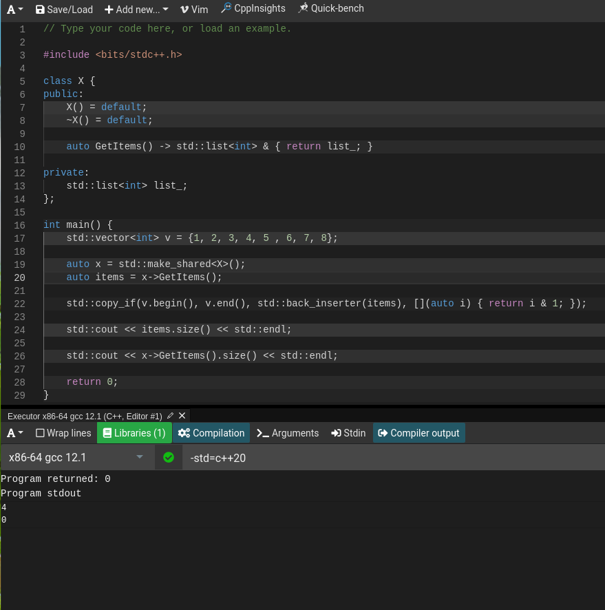
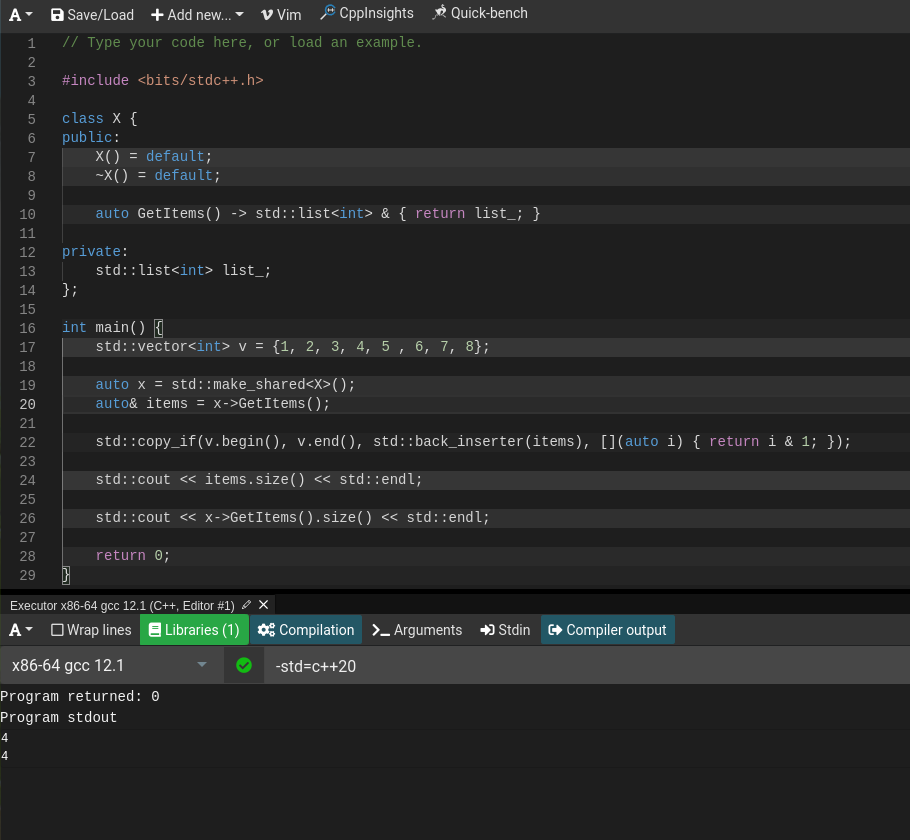

+++
title = "c++ auto的问题"
date = 2022-09-19
[taxonomies]
tags = ["c++"]
+++

问题来源：

写`Extendiable Hashing`的时候，打算将`Bucket`类中的底层容器用函数返回引用的方式暴露出来，对容器进行操作，然而因为使用了`auto`关键字，没注意细节，造成了不小的调试麻烦。

代码片段如下：

```c++
 inline auto GetItems() -> std::list<std::pair<K, V>> & { return list_; }

/// -----------------------
// ....

  auto new_bucket_x = std::make_shared<Bucket>(bucket_size_, local_depth + 1);
  auto new_bucket_y = std::make_shared<Bucket>(bucket_size_, local_depth + 1);
  auto& new_items_x = new_bucket_x->GetItems();
  auto& new_items_y = new_bucket_y->GetItems();
  int mask = bucket->GetMask();
  auto it = std::partition(items.begin(), items.end(), [mask](auto &p) { return std::hash<K>()(p.first) & mask; });
  std::copy(std::begin(items), it, std::back_inserter(new_items_x));
  std::copy(it, std::end(items), std::back_inserter(new_items_y));

// ....
```
这里的逻辑主要是以某种方式对items分类，然后将分类后元素插入两个新的bucket中。开始使用直接在`new_items_*`变量使用`auto`，并没有加上`&`，这就造成了语义的变化，本来的目的是引用，由于没有使用`auto&`变成了拷贝。

# 实例

不加`&`符号，auto会推导成`std::list<int>`值类型，因此变成了拷贝。




加上`&`，即变成了引用类型，`std::list<int>&`。

