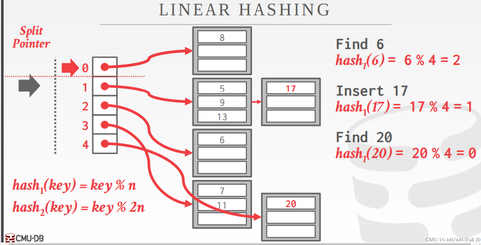

+++
title = "cmu15-455 Hash Tables"
date = 2022-08-21

[taxonomies]
tags = ["hash", "database", "cmu15-455"]
[extra]
mathjax = "tex-mml"
+++

本节分析了几种常见的hash函数，重点讲解了hash碰撞后的处理方式，包括静态hashing和动态hashing.

## 数据结构

DBMS使用各种各样的数据结构应用在系统内部的各个部分。

+ 内部元数据(internal meta-data): 追踪有关数据库和系统状态的信息
+ 核心数据存储(core data storage): 数据库中用于元组(tuples)的基本存储
+ 临时数据结构(tmeporary data structures): DBMS在处理查询时动态构建数据结构，加快查询速度(如 哈希表用于joins).
+ 表索引(table indexes): 辅助性数据结构， 便于特定元组更容易找到

设计决策(design decisions):
 1. 数据组织： 如何对内存进行布局以及在数据结构中存储哪些信息。 
 2. 并发： 如何在启用多个线程访问数据结构时不引发并发问题。

## 哈希表
哈希表实现了将键映射到值的关联数组抽象数据类型。

实现由两部分组成：
 + **Hash Functions**: 如何将一个大的key空间映射到一个更小的域中。通常需要考虑到速度和碰撞率之间的权衡。
 + **Hashing Scheme**: 如何处理key映射之后产生的碰撞。 需要在分配一个大的hash table来减少碰撞和执行额外的操作来查找和插入keys之间进行权衡。

## Hash Functions

哈希函数接受一个key作为输入，然后返回一个该key的整数表示的值。函数的输出是确定的(如相同的key总是产生相同的哈希输出)。

DBMS并不使用加密的哈希函数(如 SHA-256)，因为我们不需要考虑对键的内容进行保护。因为这些哈希函数主要作为系统内部使用，不用担心信息泄漏。

当前的`state-of-the-art`哈希函数是`Facebook XXHash3`

集中哈希函数的性能比较

## 静态Hashing Scheme

静态哈希方案是一种哈希表大小固定的应用方案。意味着如果DBMS用完了哈希表中的存储空间，那么他需要用一个更大的表重新进行构建。通常新表的大小是原来的两倍。

主要介绍三种方案：

1. `linear probe hashing`
2. `robin hood hashing`
3. `cuckoo hashing`

### Linear Probe Hashing

所有元素都存放在哈希表的数组中，不使用额外的数据结构。

线性探查(linear probe)是开发寻址法的最简单一种实现。步骤如下：

1. 插入新元素时，使用哈希函数在哈希表中定位元素位置。
2. 检查哈希表中该位置是否存在元素，如果为空，插入并返回，否则进行步骤3
3. 如果该位置为`i`, 检查`i+1`是否为空，如果已被占用，则继续检查`i+2`的位置，依次类推，直到找到一个空的位置。

这种方式的缺点是会导致同类哈希的聚类(prmary clustering)。

### Robin Hood Hashing

这是线性探查的一种扩展。寻求减少每个键在哈希表中的最佳位置到它们的最大距离。

记录每个key到其最优插入位置的探查长度。当插入一个新元素时，在探查的过程中，如果插入的元素的探查长度大于当前元素的探查长度时，那么交换这两个元素(以及探查长度)，然后继续探查。

探查长度更加平均，所以期望最长的探查长度也会显著下降。故这也是罗宾汉这个名字的由来，劫富济贫。

### Cuckoo Hashing

与之前使用单个哈希表的方案不同，这种方案使用不同的哈希函数维护多个哈希表。哈希函数是相同的(如 XXHash, CityHash)，它们使用不同的种子值对同一个key对应生成不同的哈希值。

在多个表中查找空闲的位置。因为每个哈希表只检查一个位置，所以查找和删除始终为O(1).

在插入时，检查每个表并选择任何有空闲插槽的表。

如果没有表有空闲插槽，则从其中一个删除该元素，然后重新哈希它寻找新的空闲位置。方式如下：

## 动态Hashing Scheme

类比c++中的数组和向量类型。动态哈希模式能够在不需要重建整个哈希表的情况下自动调整哈希表大小。

主要介绍三种方案：

1. `chained hashing`
2. `extendible hashing`
3. `linear hashing`

### Chained Hashing

这是最常使用的一种动态哈希方案。在每个哈希表中的`slot`中维护一个链表的`buckets`。

通过将相同hash的key的元素放到同一个`bucket`中解决冲突。
如果存储桶已满，则添加一个另外一个存储桶列表。理论上是可以无限增长的。

处理并发时，在每个`bucket`上设置一个`latch`（mutex)。

### Extendible Hashing

[论文链接](https://www.alexdelis.eu/M149/p315-fagin.pdf)

链式哈希的改进变体，可以拆分桶，而不是让链永远增长。这种方法允许哈希表多个槽(slot)指向同一个`bucket chain`。

核心思想就是前缀树与哈希结合的概念。由两部分组成：目录和叶子节点，每个叶子节点也叫做一个`bucket`。

重新平衡哈希表的核心思想在拆分时移动`bucket entries`并增加要检查的比特位数以在哈希表中查找。这意味着DBMS只需在拆分链的桶内移动数据，所有其他桶保持不变。

首先这里的hash函数是根据前几位去分bucket, 有一个全局的depth和每个bucket有一个局部的depth。depth就是表示是多少位的意思。如用2位分bucket，目录大小是4，不够了用3位去分bucket，目录大小是8。

全局的depth就代表当前的目录是用多少位分成的。局部的depth是个标识，表示这个bucket用的是几位

### Linear Hashing

这个思路也是逐步地分裂bucket。

基本思想：

假设初始bucket数是4，,按照4取模分bucket。

如果某个bucket满了，怎么处理？

首先把overflow的数据用一个临时的bucket存起来。

接着做bucket分裂，这里的bucket过程是逐步完成的，最终达到bucket翻倍。
这里注意`split pointer`，它是按顺序分裂，分裂也是按分裂点的那个桶进行分裂的，而不是从溢出的那个桶进行分裂。分裂后，`split pointer`后移一位，一次分裂结束。

对于key的计算，在分裂点之前表示已经分裂的，所以用`hash2`计算，在之后的也就是没有进行分裂的，用`hash1`计算。

