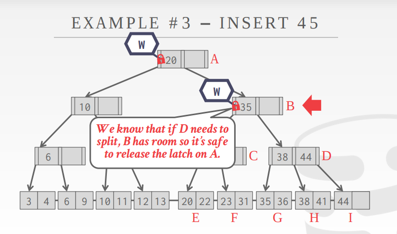

+++
title = "cmu15-455 Index Concurrency Control"
date = 2022-08-29
[taxonomies]
tags = ["cmu15-455", "database", "index concurrency"]
+++

本节讨论多线程下，如何并发地访问索引。

在DBMS中，**concurrency control**通常是一种方法，用于在并发操作共享对象时保证“正确性“结果。

然而正确性的标准也是多样的

+ Logical Correctness: Can I see the data that I am supposed to see?
+ Physical Correctness: Is the internal representation of the object sound?

其中`logical correctness`主要指应用层的事务等。

在这里主要讨论的是`Physical correctness`, 内部数据结构的并发访问。

在数据库领域，这里做一下`lock`和`latch`的区别，latch其实才是我们在并发编程中所熟悉的锁的概念，而lock是在处理DBMS并发控制，如事务处理中用到的概念。
因此，讨论内部数据结构的并发控制，用的是latch.

latch可以分为两种模式，读和写。从下表中可以看出，要解决的冲突是读写冲突，而读读是没有冲突的。

**DBMS中的Latch**

现代CPU硬件都提供了关于实现latch的原语指令，如`compare-and-swap`(CAS)。这里简要介绍一下DBMS实现latch的几种方法。

1. 借助操作系统内部构建的mutex（如linux的futex)。

这种方式因为借助了OS的管理，所以对与DBMS来说并不是好的idea，同时有很大的开销。

`std::mutex`.

优点是简单，缺点是开销和扩展性。

2. Test-and-Set Sping Latch(TAS)

`test-and-set`也是硬件提供的一种并发原语。它对比使用OS内置的实现，由DBMS控制，所以更有效率。

`std::atomic<T>`

优点是latch/unlatch更高效。缺点是扩展性和缓存不友好。

3. Reader-Writer Latch

这就是所熟悉的读写锁，允许读者并发读，管理读写队列避免饥饿。其在自旋锁的基础上实现。

优点是允许并发读。缺点是管理读写队列，大存储的开销很大。

### 哈希表

在哈希表中主要有两种方法应对并发访问。

+ Page Latches

每个页拥有一个读写latch。线程在访问页时需要获取读或者写latch。这种方式降低了并行，因为可能只有一个进程在同一时间访问一个页.

+ Slot Latches

每个slot拥有一个latch。这增加了并行，因为两个线程能在同一个页中访问不同的slot。但是这也增加了存储和计算开销。

### B+树

这是数据库中主要的索引结构。解决访问冲突的方式称为，**Latch carbbing/coupling**

读的处理比较简单，从root开始，只要能获取到child的latch，就可以释放parent。

更新会复杂一些，因为当更新当前节点，可能导致split或者merge，这样父节点也要更新。所以同时获取父子两层的latch，只有当不会发生split或merge，不需要改动父节点的时候，才释放父节点的latch.

+ 以删除为例，对于删除，我们需要考虑是否merge

在B的时候，我们不能释放A的latch，因为只有一个35，可能在delete的过程中需要merge。
但是到了C，C有38，44，删除一个也不会导致merge，所以可以释放A，B的latch.

+ 同样对于插入，我们要考虑是否split

B的时候有一个空位，没有split风险，故可以释放A。到了D的时候，可能有split风险，故不能释放B，到I发现有空，故释放B，D.

对于需split的插入列子，如下，到F的时候发现需要split，所以不能释放C，C也要增加节点。

这个方法有个显著的问题，所有的更新第一步都是从root开始。
root会成为明显的瓶颈，因为所有锁都要从root开始锁起。

故可以进行优化

假设大部分更新是不需要split和merge的，否则效率反而更低了。如果不需要split和merge，就需要给parent加写latch。用读latch，首先避免了每次都在root写写冲突，因为读读是不冲突的，而且又保证了读写冲突，因为别人在更新使，你需要等待。

[优化算法paper](https://link.springer.com/article/10.1007/BF00263762)

**Leaf Node Scan**

前面的latch都是top-down的方式，因为加锁方向一致，不会有环产生，所以不会产生死锁。

但B+树在leaf node之间也是有指针的，这就会形成环。

读的场景，不冲突

写的场景，产生冲突

T2冲突的时候，有两个选择，一个是等待，一个是自杀(防止死锁)，因为T2不知道T1在做啥，所以一个合理的方式是，等待一个timeout，然后自杀，这样可以有效避免死锁。

**延迟对parent更新**

这样对parent更新可以批量，并且降低写latch的冲突概率。

后续有线程单独进行更新parent

