+++
title = "cmu15-455 Indexes"
date = 2022-08-21

[taxonomies]
tags = ["hash", "database", "cmu15-455", "B+Tree", "indexes"]
[extra]
mathjax = "tex-mml"
+++

本章主要描述索引，即通过什么样的数据结构可以更加快速地查询到数据，介绍Hash Tables, B+Tree, SkipList。

**在数据之外，DBMS还维护这满足特定查找算法的数据结构，这些数据结构以某种方式引用(指向)数据，这样就可以在这些数据结构上实现高级的查找算法。这种数据结构就是索引**

## 数据结构

DBMS使用各种各样的数据结构应用在系统内部的各个部分。

+ 内部元数据(internal meta-data): 追踪有关数据库和系统状态的信息
+ 核心数据存储(core data storage): 数据库中用于元组(tuples)的基本存储
+ 临时数据结构(tmeporary data structures): DBMS在处理查询时动态构建数据结构，加快查询速度(如 哈希表用于joins).
+ 表索引(table indexes): 辅助性数据结构， 便于特定元组更容易找到

设计决策(design decisions):
 1. 数据组织： 如何对内存进行布局以及在数据结构中存储哪些信息。 
 2. 并发： 如何在启用多个线程访问数据结构时不引发并发问题。

## 哈希表
本节分析了几种常见的hash函数，重点讲解了hash碰撞后的处理方式，包括静态hashing和动态hashing.

哈希表实现了将键映射到值的关联数组抽象数据类型。

实现由两部分组成：
 + **Hash Functions**: 如何将一个大的key空间映射到一个更小的域中。通常需要考虑到速度和碰撞率之间的权衡。
 + **Hashing Scheme**: 如何处理key映射之后产生的碰撞。 需要在分配一个大的hash table来减少碰撞和执行额外的操作来查找和插入keys之间进行权衡。

### Hash Functions

哈希函数接受一个key作为输入，然后返回一个该key的整数表示的值。函数的输出是确定的(如相同的key总是产生相同的哈希输出)。

DBMS并不使用加密的哈希函数(如 SHA-256)，因为我们不需要考虑对键的内容进行保护。因为这些哈希函数主要作为系统内部使用，不用担心信息泄漏。

当前的`state-of-the-art`哈希函数是`Facebook XXHash3`

集中哈希函数的性能比较
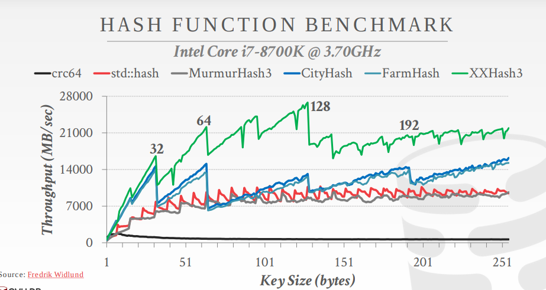

### 静态Hashing Scheme

静态哈希方案是一种哈希表大小固定的应用方案。意味着如果DBMS用完了哈希表中的存储空间，那么他需要用一个更大的表重新进行构建。通常新表的大小是原来的两倍。

主要介绍三种方案：

1. `linear probe hashing`
2. `robin hood hashing`
3. `cuckoo hashing`

#### Linear Probe Hashing

所有元素都存放在哈希表的数组中，不使用额外的数据结构。

线性探查(linear probe)是开发寻址法的最简单一种实现。步骤如下：

1. 插入新元素时，使用哈希函数在哈希表中定位元素位置。
2. 检查哈希表中该位置是否存在元素，如果为空，插入并返回，否则进行步骤3
3. 如果该位置为`i`, 检查`i+1`是否为空，如果已被占用，则继续检查`i+2`的位置，依次类推，直到找到一个空的位置。

这种方式的缺点是会导致同类哈希的聚类(prmary clustering)。

#### Robin Hood Hashing

这是线性探查的一种扩展。寻求减少每个键在哈希表中的最佳位置到它们的最大距离。

记录每个key到其最优插入位置的探查长度。当插入一个新元素时，在探查的过程中，如果插入的元素的探查长度大于当前元素的探查长度时，那么交换这两个元素(以及探查长度)，然后继续探查。

探查长度更加平均，所以期望最长的探查长度也会显著下降。故这也是罗宾汉这个名字的由来，劫富济贫。

#### Cuckoo Hashing

与之前使用单个哈希表的方案不同，这种方案使用不同的哈希函数维护多个哈希表。哈希函数是相同的(如 XXHash, CityHash)，它们使用不同的种子值对同一个key对应生成不同的哈希值。

在多个表中查找空闲的位置。因为每个哈希表只检查一个位置，所以查找和删除始终为O(1).

在插入时，检查每个表并选择任何有空闲插槽的表。

如果没有表有空闲插槽，则从其中一个删除该元素，然后重新哈希它寻找新的空闲位置。方式如下：
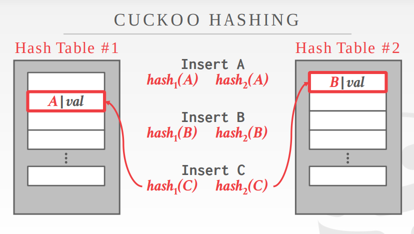
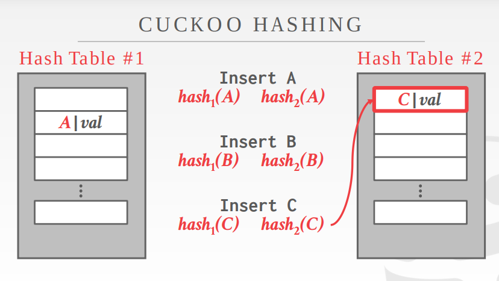
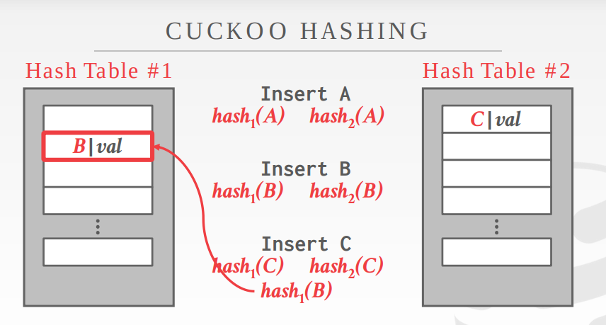

### 动态Hashing Scheme

类比c++中的数组和向量类型。动态哈希模式能够在不需要重建整个哈希表的情况下自动调整哈希表大小。

主要介绍三种方案：

1. `chained hashing`
2. `extendible hashing`
3. `linear hashing`

#### Chained Hashing

这是最常使用的一种动态哈希方案。在每个哈希表中的`slot`中维护一个链表的`buckets`。

通过将相同hash的key的元素放到同一个`bucket`中解决冲突。
如果存储桶已满，则添加一个另外一个存储桶列表。理论上是可以无限增长的。

处理并发时，在每个`bucket`上设置一个`latch`（mutex)。

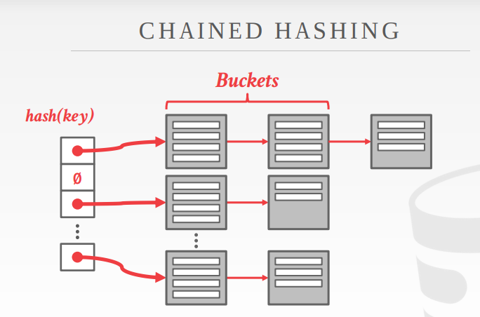

#### Extendible Hashing

[论文链接](https://www.alexdelis.eu/M149/p315-fagin.pdf)

链式哈希的改进变体，可以拆分桶，而不是让链永远增长。这种方法允许哈希表多个槽(slot)指向同一个`bucket chain`。

核心思想就是前缀树与哈希结合的概念。由两部分组成：目录和叶子节点，每个叶子节点也叫做一个`bucket`。

重新平衡哈希表的核心思想在拆分时移动`bucket entries`并增加要检查的比特位数以在哈希表中查找。这意味着DBMS只需在拆分链的桶内移动数据，所有其他桶保持不变。

首先这里的hash函数是根据前几位去分bucket, 有一个全局的depth和每个bucket有一个局部的depth。depth就是表示是多少位的意思。如用2位分bucket，目录大小是4，不够了用3位去分bucket，目录大小是8。

全局的depth就代表当前的目录是用多少位分成的。局部的depth是个标识，表示这个bucket用的是几位

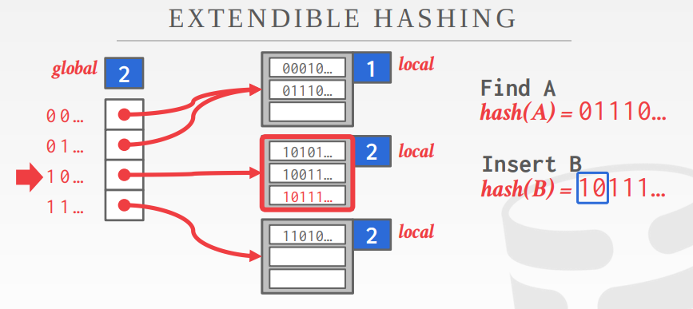

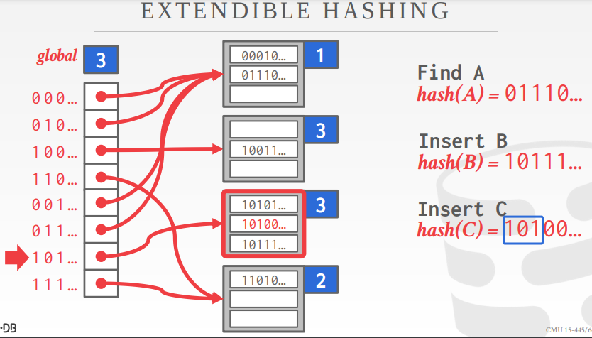

#### Linear Hashing

这个思路也是逐步地分裂bucket。

基本思想：

假设初始bucket数是4，,按照4取模分bucket。

如果某个bucket满了，怎么处理？

首先把overflow的数据用一个临时的bucket存起来。

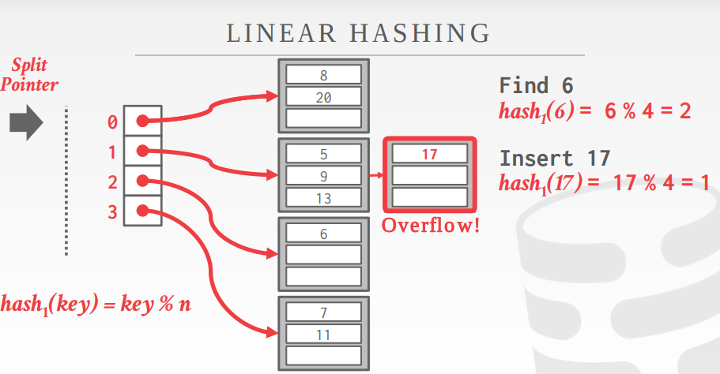

接着做bucket分裂，这里的bucket过程是逐步完成的，最终达到bucket翻倍。
这里注意`split pointer`，它是按顺序分裂，分裂也是按分裂点的那个桶进行分裂的，而不是从溢出的那个桶进行分裂。分裂后，`split pointer`后移一位，一次分裂结束。

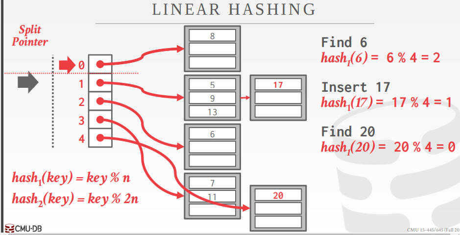

对于key的计算，在分裂点之前表示已经分裂的，所以用`hash2`计算，在之后的也就是没有进行分裂的，用`hash1`计算。

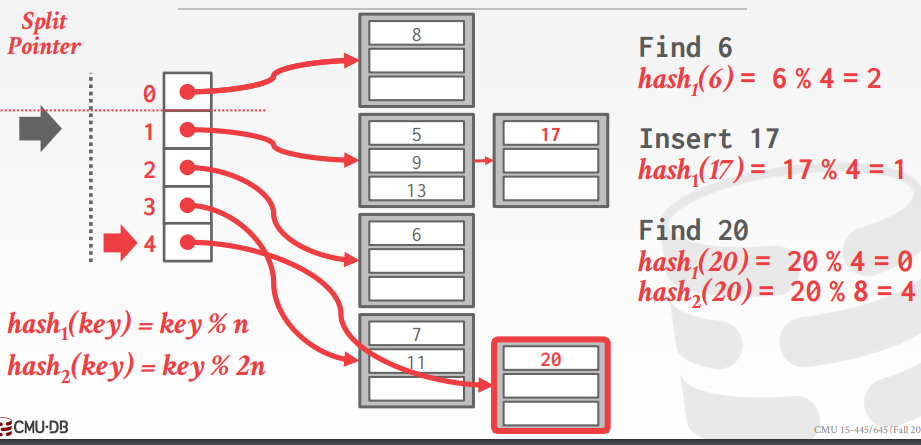

## Tree indexes

对于数据库而言，使用树系列，二叉树，红黑树，B树，B+树等，因为要考虑到range查询，所以哈希索引不行。

### Table indexes

对于`table indexes`而言，其可能会涉及到范围扫描查询。英文是这么描述，
`A table index is a replica of a subset of a table's columns that is organized and/or sorted for efficient access using a subset of those attribute.`

### B+Tree

b+树是一种自平衡的树。

我们说的BTree, 往往说的都是B+Tree。B-tree和B+tree的区别就在于`inner node`是否存储数据。

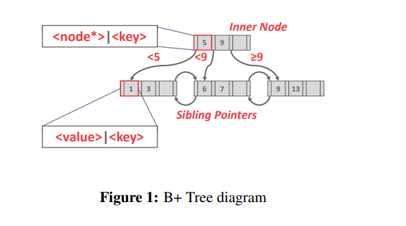

**B+Tree有如下特性**：
 + `M-way`而非二叉，有效降低树高。
 + 每一个`inner node`至少是half-full，**M/2-1 <= #keys <= M-1**。这样提高读取效率，读取一个节点，往往是一个page,可以读取尽可能多的数据。
 + `inner node`, 对于`k`个keys，要有`k+1`个非null子节点。

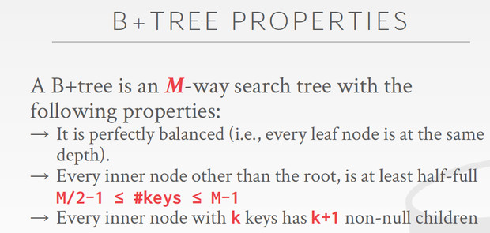

**B+树的结构**

如上图一所示，其节点分为
  + `inner node`
  + `leaf node`

每一个b+树的节点都是由一个key/value对的数组组成。

`inner node`只有索引，而`leaf node`包含真实的数据，同时还有`sibling pointers`，这是为了更有效的range查询。

通常这些数组通过key进行排序。

`Leaf Node`的结构如下：
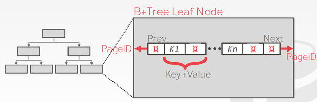
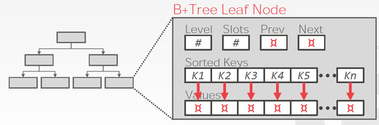

两种不同的kv存储方式，这里的pageID需要理解一下，因为往往B+树的一个节点相当于一个page，所以跳到下一个节点就是跳到另外一个page。

Leaf节点的内容(value)也分两种：
+ Record Ids
+ Tuple Data

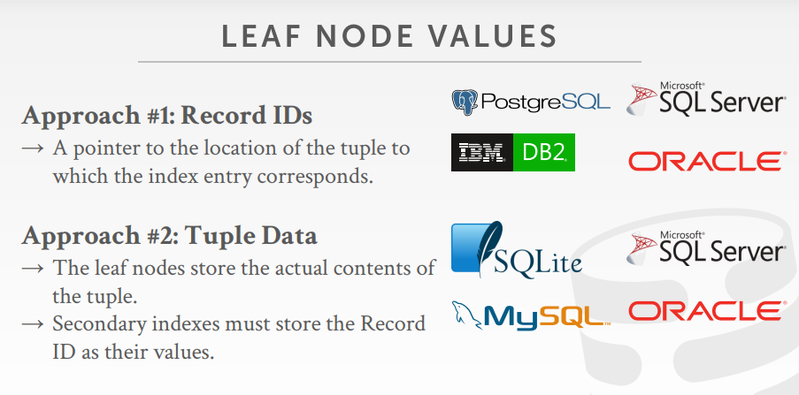

**B+树的插入和删除**

插入的关键是如果节点满了，需要分裂，分裂完了要把`middle key`放到上一层节点中做索引，如果上一层也满了，就需要进一步分裂。
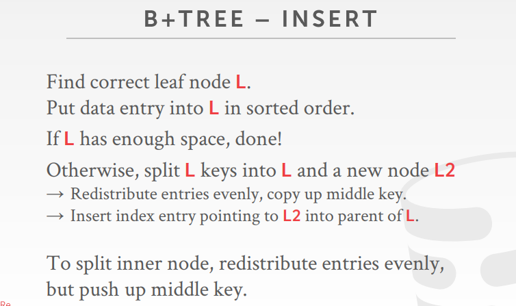

删除的关键是如果删除后，节点小于half-full了，需要先试图从sibling去借一些key达到half-full, 如果sibling也达不到half-full，那就合并。
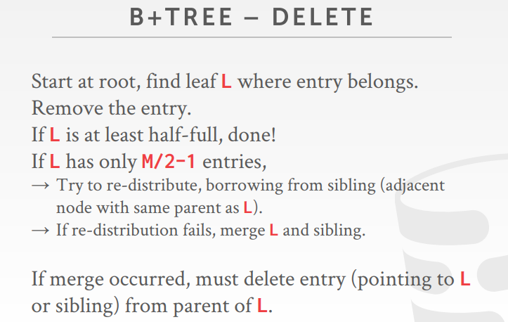

**变长keyss**
  + 指针：存储键作为元组属性的指针(很少使用)
  + 可变长度节点：B+树中每个节点的大小可能不同，但需要仔细的内存管理。这种方法也很少使用。
  + 键映射：嵌入一组指针，指针是映射到节点key+value。类似之前在存储部分讨论的slotted page。(常用方法)

  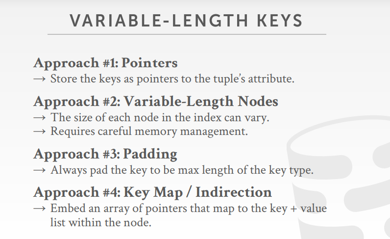
  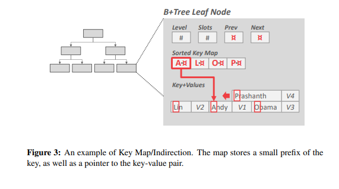

**重复keys**

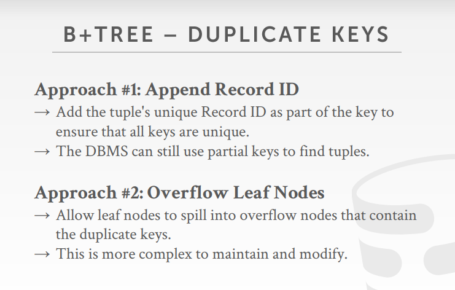

**节点内部的查找方法**

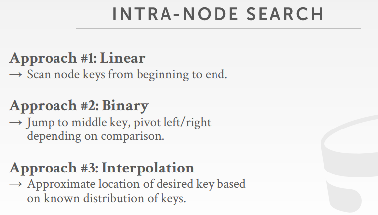

**B+树一些其他优化**

前缀压缩，重复数据消除，批量插入。

+ 前缀压缩指在一个叶子节点上，如果key拥有共同前最，可以提取出来，节约空间。
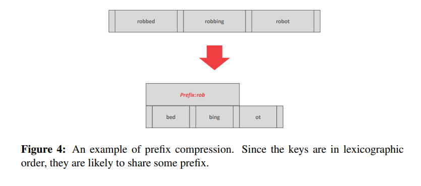

+ 重复数据消除指在非唯一索引中，在叶节点中存在相同的key对应多个值，可以把这些重复的key消除。
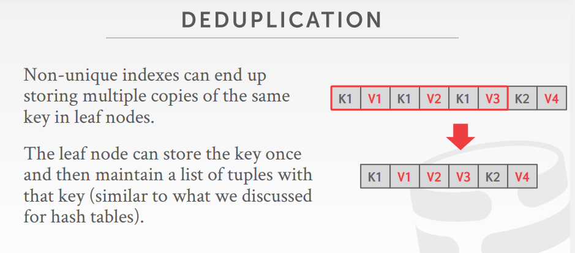

+ 批量插入，一个一个插入效率低，因为需要不断做分裂。高效的做法是，等插入了很多之后，一次性做一个B+树重建。

#### Cluster Indexes

clustered indexes 是b+树的应用。在Innodb中，每个表都有一个聚簇索引，该索引是根据primary key对行记录生成的b+树索引，如果没有primary key，会自动生成自增id作为替代。叶子节点存放行数据，称之为数据页，故表中的数据也树聚簇索引中的一部分，数据页通过一个双向链表连接。

除了clustered Indexes以外，都称为Secondary Indexes，与聚簇索引的区别在于辅助索引的叶子节点中存放的是主键的键值，clustered indexes只有一个，但辅助索引可以有多个。因此，通过辅助索引只能查到主键id，如果要读到数据，还需要查一次聚簇索引，好处是辅助索引不包含数据，所以远小于聚簇索引，查询效率高。

可以用一列，或者多列来创建辅助索引，称为联合索引，联合索引和普通索引的结构没什么不同，只是会在节点中同时记录下多个列的值，遵循最左原则，先按第一个列排序，再按第二列排，依次下去。因此，查询条件也需要遵循最左原则。

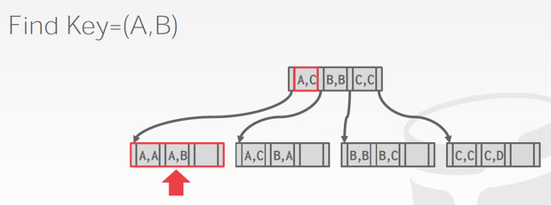

#### Additional Index Usage

除了常规索引外，DBMS还存在许多额外的索引方法。

+ 隐式索引(Implicit Indexes): 大多数DBMS都会自动创建一个索引，保证完整性约束。(e.g., primary key, unique constraints) 
+ 部分索引(Partial Indexes): 对整个表的子集创建索引。这减少了相应的开销和大小。
+ Convering Indexes
+ Index Include Columns
+ Functions/Expression Indexes

### SkipList（跳表）

[wiki](https://en.wikipedia.org/wiki/Skip_list) & 
[paper](http://dl.acm.org/citation.cfm?id=78977)

如果用有序数组来实现索引，可以用简单的二分，但是插入和删除会比较麻烦。最简单的方法实现动态保存的index是使用有序链表，但链表只支持线性搜索，时间复杂度为O(n)。如何让链表也能二分查找，提高查询效率，这就是skip list.

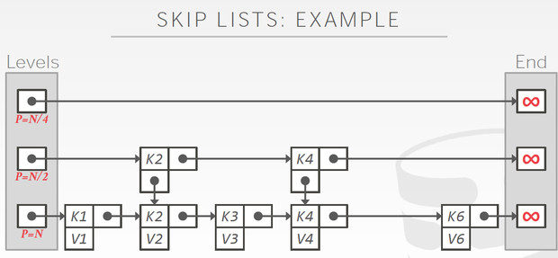

跳表的数据存放在第一层，上面的都是索引，这样避免一个个遍历，越往上层建的索引越稀疏，总之是为了模拟出二分，用空间换时间，因此时间复杂度近似O(log(n)).

+ 跳表的插入

如下图，插入(k5,v5)，这里如何建立索引？即要把k5加到哪几层去。

答案是flip coin(一个伯努力过程)。连续抛硬币，连续出现的正面的次数为k，我们就会对k层建立索引，如果k大于当前最大的level，就需要建立新的level。这样做有两个好处，因为伯努力过程，所以自然越高的level出现的概率越低，以`1/2`降低，并且插入的数据越多，出现较大k的概率越大。

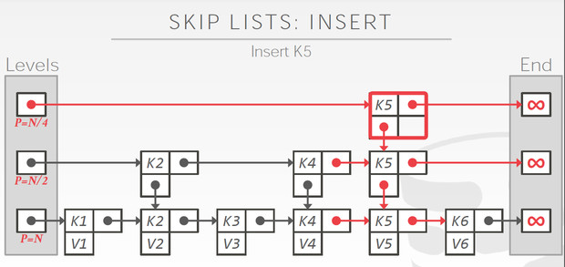

+ 跳表查询

查询以二分的思路就行。
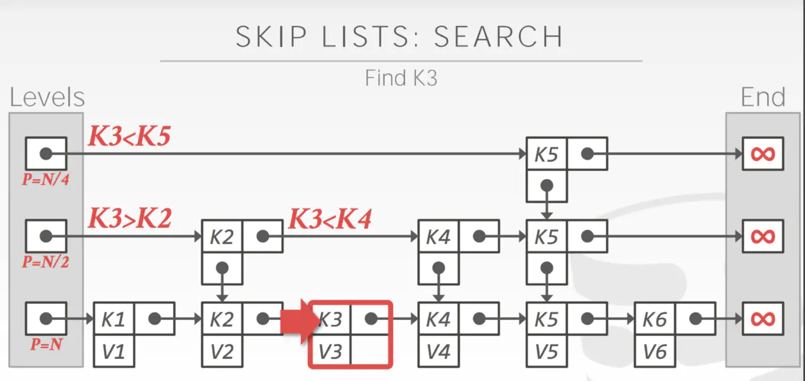

+ 跳表删除

关键需要一个标识，先逻辑删除，再物理删除。

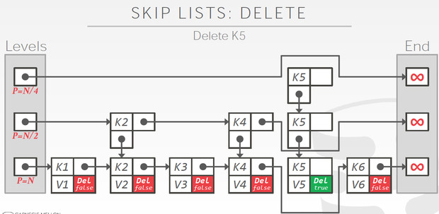
 
跳表的优点，相对b+树更节约内存，不需要rebalance。

缺点是对缓存不友好，因为是链表的关系。其次是反向查找不方便。

### Radix tree(基数树)

在b+树中，`inner node keys`并不会告诉你你要找的key是否存在，因此，你必须遍历到`leaf node`。这意味着，在树中的每个层上至少有一个buffer pool page未命中，只是为了发现某个key不存在。

使用trie tree对key进行表示，这样就不用比较整个key。

核心思路，前缀树(trie tree)，节点的path就代表key，可以reconstructed.
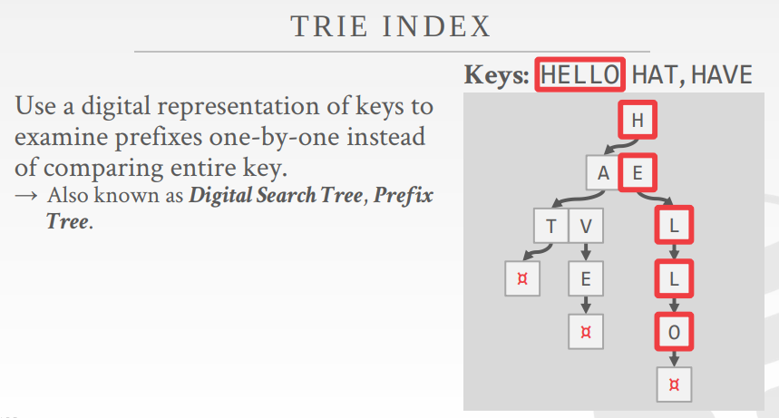

树高取决于key的length，而不是key的多少，key增多，那么表示key的length肯定会变长，也不需要rebalance.

Radix Tree和Trie Tree的区别，Radix只有共享的才需要单独的节点。

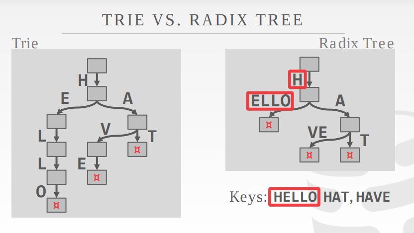

Radix的有点就是插入和删除很简单。

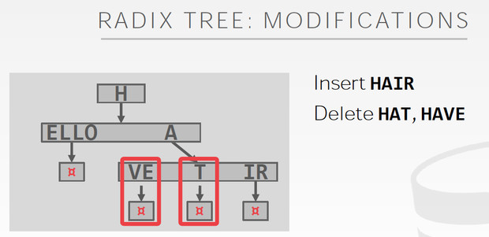

## Index Concurrency Control

本节是讨论多线程并发访问索引。
