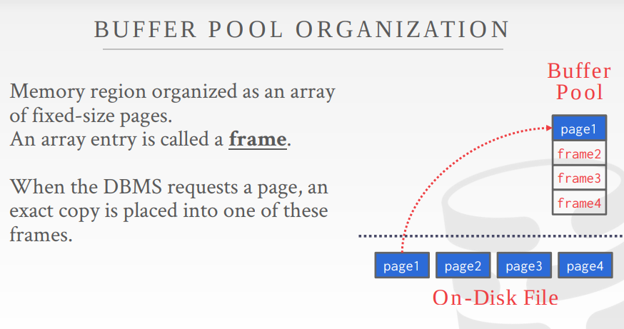
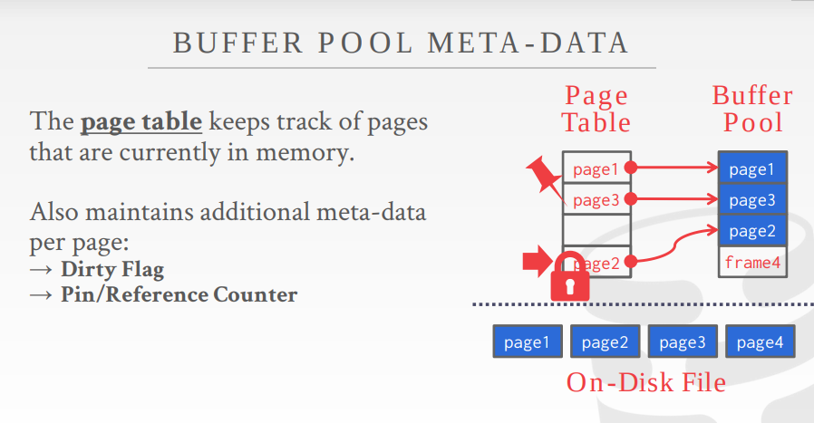
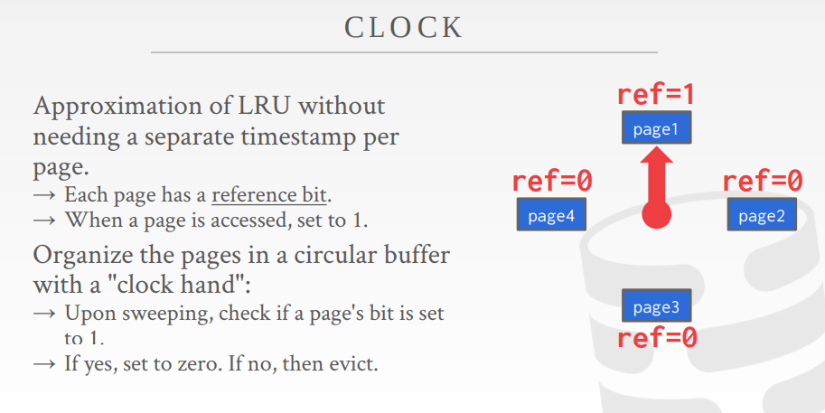
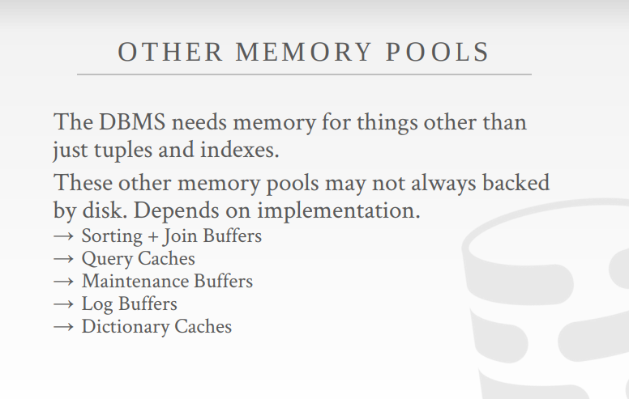

+++
title = "Buffer Pool"
date = 2022-08-19
[taxonomies]
categories = ["cmu15-455"]
tags = ["buffer pool", "database"]
+++

# Buffer Pool

+ Buffer Pool Manager
+ Replacement Policies
+ Other Memory Pools

## Locks vs. Latches

we need to make a distinction between locks and latches when discussing how the DBMS protects its internal elements.

+ **Locks**
  + Protect the database logical contents.(e.g., tuples, tables, databases) from other transactions.
  + Held for transaction duration.
  + Need to be able to rollback changes.

+ **Latches** (Mutex)
  + Protect the critical sections of the DBMS's internal data structures from other threads.
  + Held for operation duration.
  + Do not need to be able to rollback changes.

## Buffer Pool

  The *buffer pool* is an in-memory cache of pages read from disk.

The DBMS always knows better so we want to manage memory and pages ourselves.

It is a region of memory organized as an array of fixed size pages. Each array entry is call a **frame**. When the DBMS requests a page, an exact copy is placed into one of these frames.

Meta-data maintained by the buffer pool:
  + **Page Table**: In-memory hash table that keeps track of pages that are currently in memory. It maps page ids to frame locations in the buffer pool.
  + **Dirty-falg**: Threads set this flag when it modified a page. This indicates to storage manager that the page must be written back to disk.
  + **Pin Counter**: This tracks the number of threads that are currently accessing that page.(reading or modifing it). A thread has no increment the counter before they access the page. If a page's count is greater than zero, then the storage manager is not allowed to evict that page from memory.

  

Optimizations:
  + **Multiple Buffer Pools**: The DBMS can also have multiple buffer pools for different purposes. This helps reduce latch contention and improves locality.
  + **Pre-Fetching**: The DBMS can also optimize by pre fetching pages based on the query plan. Commonly done when accessing pages sequentially.
  + **Scan Sharing**: Query cursors can attach to other cursors and scan pages together.

Allocation Policies:
  + **Global Policies**: How a DBMS should make decisions for all active txns.
  + **Local Policies**: Allocate frames to a specific txn without considering the behavior of concurrent txns.

## Replacement Policies

A replacement policy is an algorithm that the DBMS is implements that makes a decision on which pages to evict from buffer pool when it needs space.

goals:
  + Currectness
  + Accuracy
  + Speed
  + Meta-data overhead

### LRU(Least Recently Used)

 + Maintain a timestamp of when each page was last accessed.
 + DBMS picks to evict the page with the oldest timestamp.

### CLOCK
  Approximation of LRU without needing a spearate timestamp per page.

+ Each page has reference bit. 
+ When a page is accessed, set to 1

Organize the pages in a circular buffer with a "clock hand"
  + Upon sweeping check if a page bit is set to 1
  + If yes, set to 0, if not, then evict.
  + Clock hand remembers position between evictions.

### Alternatives
Problems with LRU and CLock replacement Policies:
  + LRU and CLock are susceptible to **sequential flooding** where the buffer pool's contents are trashed due to a sequential scan.
  + It may be that the LRU page is actually important due to not tracking meta-data of how a page is used.

Better solutions:
  + LRU-K: Take into account history of the last K references
  + Priority hints: Allow txns to tell the buffer pool whether page is important or not
  + Location: Choose pages to evict on a per txn/query basis.

## Other Memory Pools 

