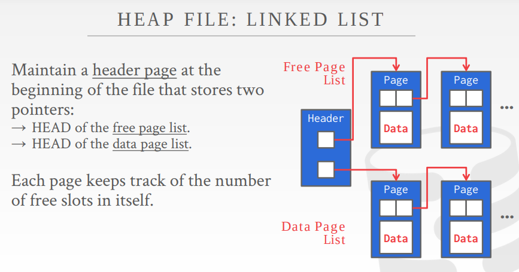

+++
title="Database Storage"
date=2022-08-19

[taxonomies]
# categories = ["cmu15-455"]
tags = ["storage", "database"]
+++
# Database Storage

 

## Disk-oriented architecture

we will foucs on a `disk-oriented` DBMS architecture that assume that **primary storage location of the database is on non-volatile**

+ **storage architecture:**

+ **Volatile vs. Non-Volatile**

  + **Volatile Devices**
    + Random Access
    + Byte-Addressable
  
  + **Non-Volatile Devices**
    + Block/page addressable
    + Sequential access

磁盘与内存之间的读写存在比较大的速度差距，如何高效地在易失性和非易失性之间交换数据(读写), DBMS的设计应该考虑隐藏这种延迟.

## Disk-Oriented DBMS

The database is all in disk, and the data in the database files is organized into pages, and the first page is the directory page.

In order to operate on the data the DBMS needs to bring the data into memory. It does this by having _buffer pool_ that **manages the movement back and forth between disk and memory.**

The DBMS also have an execution engine that will execute queries. The execution engine will ask the buffer pool for a specific page, and the buffer pool will take care of bringing that page into memory and giving the execution engine a pointer to the page in memory. The buffer pool manager will ensure that page is there while the execution engine is operating on that memory.

## DBMS vs. OS

they are all very complicated essential softwares.

**high level design goal**:
  
  + DBMS is to support databases that exceed the amount of memory aviablie. Since the r/w is expensive, it is manged carefully. We do not want large stalls from fetching something from disk to slow down everything else. So we want the DBMS to be ables to process other queries while it is waiting to get the data from disk.

  + like virtual memory, where there is a large address space and a place for the OS to bring in pages from disk.

+ possible to use the OS by using:
  + `madive`: Tells the OS know when you are planning on reading certain pages.
  + `mlock`: Tells the OS to not swap memory ranges out to disk.
  + `msync`: Tells the OS to flush ranges out to disk.

## File Storage

The DBMS stores a database as one or more files on disk. Some may use a file hierarchy, others may use a single file(e.g., SQLite).

The OS does not know anything about the contents of these files. Only the DBMS knows how to decipher their contents, since it is encoded in a way specific to the DBMS.

The DBMS's _storage manager_ is responsible for managing a database's files.
  + files as collection of page
  + keep track of what data has been read and written to pages, as well how much free space there is in the page.

## Database Pages 

**A page is a fixed-size block of data.** The DBMS organizes the database across one or more files in pages.

Pages can contain different kinds of data(tuples, meta-data, indexes, log records...)

Most systems will not mix these types within pages. Some systems will require that it is self-contained, means that all the information needed to read each page is on the page itself.

**Each page is given a unique identifier**. If the database is a single file, the the page can just the file offset. Most DBMSs have an _indirection layer_ that maps a page id to a file path and offset. The upper levels of the system  will ask for a specific page number and the storage manager will have to return that page number into a file and an offset to find the page.

Most DBMSs use fixed-size pages to avoid the engineering overhead needed to support variable-sized pages.

three concepts of pages in DBMS:
  1. Hardware page(usually 4KB)
  2. OS page(4KB)
  3. Database page(1-16KB)

The storage device gurantees an atomic write of the size the hardware page. (If our database page is large than our hardware page, the DBMS will have to extra measure to ensure that the data get written out safely since the program cant get partway through writing a database page to disk when system crashes.)

## Database Heap

There are a couple of ways to find the location of the page a DBMS wants on the disk, and the heap file organization is one of the ways.
  + Heap File
  + Sequential/Sorted File
  + Hashing File

**A _heap file_ is an unordered collection of pages where tuples are stored in random order.**

The DBMS can locate a page on disk given a `page_id` by using a linked list of pages or a page directory
1. **Linked List**: Header page holds pointers to a list of free pages and a list of data pages. However, if teh DBMS is looking for a specific page, it has to do a sequential scan on the data page list until it finds the page it is looking for.
2. **Page Directory**: DBMS maintains special pages that track locations of data pages along with the amount os free space on each page.

## Page Layout

**Every page includes a header that records meta-data about the page's contents**:
  + Page size
  + Checksum
  + DBMS versin
  + Transaction visibility
  + Some systems require pages to be self-contained.

`strawman`数据布局的方法在删除tuple或者tuple有可变长度的属性的时候会出现问题。

There are two main approach to laying out data in pages.
  1. slotted-pages
  2. log-structured

**Slotted Pages**: Pages maps slots to offsets.
  + Most common approach used in DBMSs today
  + To add a tuple, slot array 从头到尾增长，tuple data 将从尾到头增长， 当slot array 和 tuple data相遇时视为页满。
  + Header keeps track of the number of slots and the offset of the starting location of last used slot and a slot array.

**Log-Structured**: Instead of storing tuples, the DBMS onlu stores log records.

## Tuple Layout

**A tuple is essentially a sequence of bytes.** It is DBMS's job to interpret those bytes into attribute types and values.

**Tuple Header**: Contains meta-data about the tuple
  + Visbility information for the DBMS's concurrency control protocol.
  + Bit Map for NULL values.
  + Note that the DBMS dose not need to store meta-data about the schema of the database here.

**Tuple Data**: Actual data for attributes.
  + attributes are typically stored in the order that you specify them when you create the table.
  + Most DBMSs do not allow a tuple to exceed the size of a page.

**Unique Identifier**:
  + Each tuple in the database is assigned a unique identifier
  + Most common: `page_id + (offset or slot)`
  + An application **cannot** rely on these ids to mean anything

**Denormalized Tuple Data**: If two tables are related, the DBMS can "pre-join" them, so the tables end up on the same page. (read faster, but make updates more expensive)

## Data Representation

Tuples' data is essentially just byte arrays. It is up to the DBMS to know how to interpret those bytes to derive the values for attributes.

A _data representation_ scheme is how a DBMS stores the bytes for a value.

four main types that can be stored in tuples: integers, variable precision numbers, fixed point precision numbers, variable length values, and dates/times.

+ **Integers**
  + Most DBMSs store integers using their "native" c/c++ types as specified by the IEEE-754 standard.
  + `INTEGER, BIGINT, SMALLINT, TINYINT`

+ **Variable Percision Numbers**
  + also use the "native" c/c++ types specified by IEEE-754.
  + faster to computer because CPU can execute instructions on them directly.
  + `FLOAT, REAL`
  
+ **Fixed Point Precision Numbers**
  + numeric data types with arbitary precision and scale. They are typically stored in exact, variable-length binary representation with additional meta-data that will tell the system things like where the decimal should be.
  + used when rounding errors are unacceptable.(but performance penalty)
  + `NUMERIC, DECIMAL`

+ **Variable Length Data**
  + An array of bytes of arbitary length.
  + Has a header which keeps track of the length of the string to make it easy to jump to he next value. 
  + Some systems will let you store these large values in an external file, and then the tuple will contain a pointer to that file.(such as photo, music ...). one downside of this is that the DBMS cannot manipulate the contents of this file.
  + `VARCHAR, VARBINARY, TEXT, BLOB`

+ **Datas and Times**
  + `TIME, DATA, TIMESTAMP`

 **System Catalogs**

In order for the DBMS to be able to read these value, it maintains an internal catalog to tell it meta-data about the databases.

The meta-data will contain what tables and columns the databases have along with their types and the orderings of the values.

  + Tables, columns, indexes, views
  + User, permissions,
  + Internal statistics

## Workloads

**OLTP: On-line Transanction Processing**
  + Fase, short running operations
  + Queries operate on single entity at a time
  + More wirtes than reads
  + Repetitive operations
  + Uaually the kind of application that people build first
  + Example: User invocations of Amazon. They can add things to their cart, They can make purchases, but the actions only affect their account.
  

**OLAP: On-line Analytical Processing**
  + Long running more complex queries
  + Reads large portions of the database
  + Exploratory queries
  + Deriving new data from data collected on the OLTP side
  + Example: Compute the five most bought items over a one month period for these geographical locations.
  

## Storage Models

There are different ways to store tuples in pages. We have assumed the **n-ary storage model** so far.

### N-Ary Storage Model(NSM)
  
The DBMS stores all of the attributes for a single tuple contiguously, so NSM is also known as a "row store".

This approach is ideal for OLTP workloads where transactions tend to operate only an individual entity and insert heavy workloads.

only one fetch to be able to get all of the attributes for a single tuple.

**Advantages**
 + Fast inserts, updates, and deletes.
 + Good for queries that need the entire tuple.

**Disadvantages**
  + Not good for scanning large portions of the table and/or a subset of the attributes. This is because it pollutes the buffer pool by fetching data that is not needed for processing the query.

two different ways to organize a NSM database:
  + **Heap-Origanized**: Tuples are stored in blocks called a heap, and the heap dose not necessarily define an order.
  + **Index-Origanized**: Tuples are stored in the primary key index itself, but different from a clustered index.

### Decomposition Storage Model(DSM)

The DBMS stores a single attribute(column) for all tuples contiguously in a block of data. Also known as a "column store".

This model is ideal for OLAP workloads where read-only queries perform large scans over a subset of the table's attributes.

**Advantages**
  + Reduces the amount of wasted work during query execution because the DBMS only reads the data that it needs for that query.
  + Enable better compression because all of the values for the same attribute are sotred contiguously.

**Disadvantages**
  + Slow for point queries, inserts, updates, and deletes because of the tuple splitting/stitching.

To **put the tuples back together** when are using a column store, we can use:
  + **Fixed-length offset**:
    + Start by assuming the attributes are all fixed-length.
    + Then when the system wants the attribute for a specific tuple, it knows how to jumps that spot in the file. To accomandate the variable-length fields, the system can pad them so that they are all the same length, or you could use a dictionary that takes a fixed-size integer and maps the integer to the value.

  + **Embedded Tuple IDs**:
    + For every attribute in the columns, store the tuple id with it. The system would also need extra information to tell it how to jump to every attribute that has that id.

Most DBMS use fixed-length offsets.

Row stores are usually better for OLTP, whiil column stores are better for OLAP.
